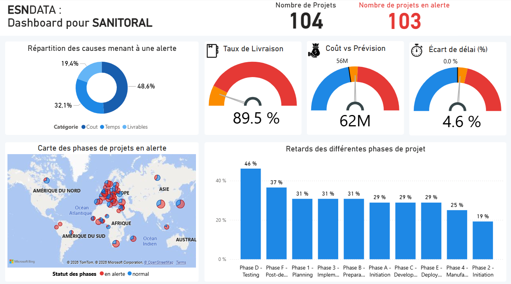

# Avancement des projets – Sanitoral
Dashboard réalisé avec Power BI

## 1. Contexte

Le service Project Management Office de Sanitoral souhaite disposer d’un tableau de bord permettant de :
- suivre l’avancement des projets et les coûts ;
- identifier les retards ;
- contrôler les performances afin de déclencher les actions correctives nécessaires.

Une réunion avec la cheffe de projet a permis d’établir une note de cadrage ainsi qu’un Product Strategy Canvas (PSC) formalisant les user stories.  
Le PSC a été validé avant la phase de construction du reporting.

## 2. Objectifs du tableau de bord

Le tableau de bord doit permettre :
- d’obtenir une vue globale et actualisée du portefeuille de projets ;
- de repérer rapidement les projets en retard ou en dépassement de budget ;
- d’analyser les performances par période, par service ou par typologie de projet ;
- de présenter un exemple d’axe stratégique issu du reporting.

Un onglet dédié doit également présenter :
- le Product Strategy Canvas ;
- la procédure de mise à jour des données via Power Query Editor ;
- une explication du modèle de données (tables, relations, transformations).

## 3. Données utilisées

Les données proviennent du logiciel interne de gestion de projets et couvrent la période 2018 à début 2022.  
Un dictionnaire des données accompagne le jeu de données.  
Le nettoyage et la préparation doivent être entièrement automatisés via Power Query Editor pour permettre une mise à jour hebdomadaire.

## 4. Méthodologie

- Analyse exploratoire et compréhension de la structure des données  
- Identification des problèmes récurrents (retards, dépassements, incohérences)  
- Création du Product Strategy Canvas et validation  
- Nettoyage automatisé via Power Query (normalisation, typage, corrections, filtres)  
- Modélisation des données (relations, tables de faits, tables de dimensions)  
- Conception du tableau de bord Power BI et création d’un onglet documentaire dédié  
- Mise en place de visuels lisibles et adaptés à l’analyse des performances

## 5. Aperçu du dashboard

Capture d’écran du rapport Power BI :

## 6. Structure du rapport Power BI

Le projet est contenu dans un seul fichier Power BI (.pbix) organisé en 5 onglets :

1. **Dashboard**
   - Visualisations principales
   - Suivi des KPI
   - Analyse interactive des données

2. **Page drill-through**
   - détails des besoins utilisateurs
   - tableau des projets en alerte
   - tableau des phases en alerte

3. **Mise à jour (Power Query)**
   - Nettoyage des données
   - Transformation et création de colonnes
   - Harmonisation des sources

4. **Schéma de données**
   - Modèle relationnel
   - Relations entre tables
   - Optimisation pour l’analyse

5. **Product Strategy Canvas**
   - Identification des besoins utilisateurs
   - Problématiques métier
   - Indicateurs attendus

